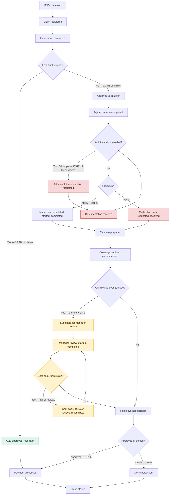

# As-is process map — claims intake

**Data source:** synthetic event log (`data/claims_event_log.csv`), 5,000 claims / 57,781 events, generated by `data/generate_claims_log.py`. All percentages and timings below are computed directly from that log — see `analysis/` for the queries.

This map reflects the process as the data shows it operating today, not a target state. Color coding flags where the quantified analysis found real pain points versus where an assumption going in (manager review) turned out to be smaller than expected.

## Legend

| Color | Meaning | Steps |
|---|---|---|
| 🟥 Red | Largest measured cycle-time drivers — external, customer/third-party dependent waits | Additional documentation requested/received, medical records requested/received |
| 🟨 Amber | Resource-constrained step — real but narrower than assumed going in (see pain point analysis) | Manager review and the send-back loop |
| 🟩 Green | The fast lane — more than a quarter of all volume resolves here in ~3.6 days | Auto-approved fast track |

## Key figures behind this map

| Metric | Value |
|---|---|
| Fast-track rate | 28.2% of all claims |
| Documentation rework rate | 16.4% of all claims (22.8% of full-investigation claims) |
| Manager review rate | 9.6% of all claims (value > $25,000) |
| Manager send-back rate | 8% of manager reviews |
| Denial rate | 9.0% of all claims |
| Overall first-contact resolution (FCR) | 82.8% |

Full detail, including the per-activity cycle-time breakdown and the claim-type/channel segmentation behind this map, is in `pain_point_analysis.md`.
