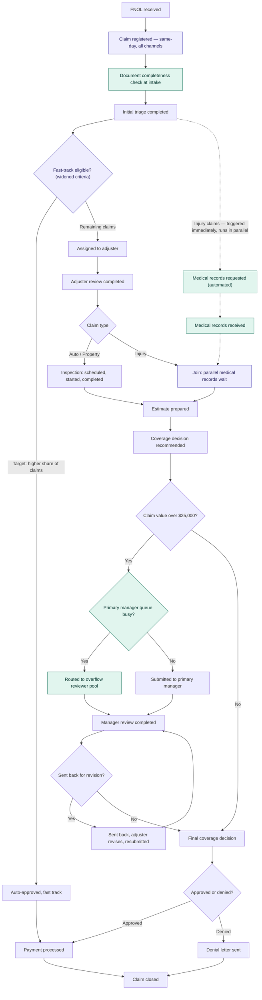

# To-be process map — claims intake

**Built from:** `pain_point_analysis.md`'s ranked priority list. Every change below traces to a specific finding — nothing here is a generic "best practice" bolted on without a number behind it.

## What changed, and why

| # | Change | Targets | Mechanism |
|---|---|---|---|
| 1 | Same-day registration on every channel | Channel-driven delay (0.7–1.3 days) | Real-time field validation on Web/Mobile intake removes the manual verification queue that today only Phone/Agent submissions skip |
| 2 | Document completeness check at intake | Documentation rework loop (16.4% of claims, 5.52-day avg wait) | Catches missing items at submission instead of after an adjuster discovers the gap mid-review |
| 3 | Medical records requested in parallel with adjuster assignment/review, not after | Injury's medical-records wait (7.44-day avg, the single largest driver in the process) | Converts a sequential 7.44-day addition into a wait that overlaps with ~3.9 days of internal review work already happening |
| 4 | Widened fast-track eligibility | Overall cycle time, especially Property (currently only 7.9% fast-tracked vs. Auto's 50.6%) | Routes more low-value, low-risk claims around the full investigation path entirely |
| 5 | Overflow reviewer pool for manager review | The p90 tail risk in manager review (4.91-day p90 vs. 0-day median) | Absorbs the periodic-load spikes that cause the tail, without adding permanent headcount |

## Projected impact — simulated, not hand-estimated

`generate_claims_log_tobe.py` implements all five changes as actual process logic against the same resource-queue mechanics as the as-is generator (see that file's docstring for how each change maps to a code change — the fork/join for Injury in particular is a structural change, not a parameter tweak). Comparing the two simulated event logs:

| Metric | As-is | To-be | Change |
|---|---|---|---|
| Blended average cycle time, all claims | 12.48 days | 9.03 days | **−3.45 days (−27.6%)** |
| Auto average (blended) | 8.55 days | 6.16 days | −2.39 days (−28.0%) |
| Property average (blended) | 13.65 days | 10.79 days | −2.86 days (−21.0%) |
| Injury average (blended) | 20.63 days | 13.92 days | **−6.71 days (−32.5%)** |
| Overall FCR | 82.8% | 94.3% | +11.5 pts |
| Fast-track rate | 28.2% | 37.1% | +8.9 pts |
| Documentation rework rate (all claims) | 16.4% | ~5.0% | −11.4 pts |
| Manager-review p90 queue wait | 5.12 days | 0.0 days | Overflow pool absorbs the tail |

These are projections from a simulation of the redesigned process, not results from an implemented system — the language throughout this project stays conditional ("projected to reduce") for exactly that reason. Injury shows the largest relative improvement, consistent with it being the most targeted pain point (parallel medical-records request + reduced rework + widened fast-track all apply there at once). The manager-review p90 result is a particularly clean validation of the overflow-pool design: a 2-person overflow pool, triggered only when the primary queue wait would exceed 1 day, removes the congestion tail without the cost of a permanent 5th manager.
